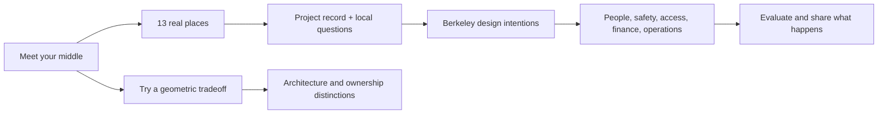

# Courtyard Block: delight and evidence review

Reviewed October 10, 2026. Scope: all 23 pages, including 13 cases and the Berkeley proposal. Existing Astro/Tailwind/GitHub Pages architecture, routes, drawings and photographic credits retained. Implementation is intentionally a field guide and a working proposal, rather than a live code database or development offer.

## Completed audit

- [x] Inspect the whole content model, navigation, layouts, routes, image handling and original diagrams.
- [x] Review deadbutt.fyi as a tone reference; keep this site's architectural identity, warm paper, terracotta, moss and serif reading voice.
- [x] Add a friendlier landing page, curious-reader FAQs and the “Make room for the middle” geometry lab.
- [x] Verify project descriptions against architect, cooperative, resident-association or city publications.
- [x] Expand every case with a useful design idea, an operational question and context-sensitive questions for Berkeley.
- [x] Distinguish courtyard shape, resident-led development, cooperative ownership, land stewardship and affordability controls.
- [x] Correct Sargfabrik's 73 original homes (1996) plus 39 in Miss Sargfabrik (2000), rather than 112 in one project/year.
- [x] Correct Gleis 21 public versus resident shared facilities; cite its resident information separately from the architect's project record.
- [x] Correct Swan's Market's multiple delivery and financing arrangements, rather than “one roof, one loan.”
- [x] Remove unsupported savings percentages, parking prices, legal-reform counts, promised timelines and geometry-based climate/community guarantees.
- [x] Retain the city prompts, scale sequence, three Berkeley scenarios and practical steps; recast them as actual questions to resolve.
- [x] Replace the biased comparison with a semantic table of tradeoffs.
- [x] Add mobile navigation, a main landmark, skip link, visible focus, native inputs/disclosures, filter state/count, reduced-motion and print behavior.
- [x] Fix nested image-credit anchors and responsive grid/metadata constraints. Preserve direct photo-license links; clearly label decorative fallback sketches.
- [x] Build and validate route/anchor integrity and the geometry model.
- [x] Hand the stable preview to the parent for browser/responsive review and serial publication. No push or deployment performed by this agent.

## Reader path



## Evidence method and source record

Project pages establish reported physical features, project teams and intended design. They are not independent proof of affordability, measured energy performance, friendship or universal resident satisfaction. Interpretive questions are explicitly identified as ours. Approximate resident counts are time-dependent. No financial or legal feasibility for a particular parcel is asserted.

| Case | Primary source | Main use / correction |
| --- | --- | --- |
| La Borda | [Lacol project account](https://lacol.coop/projectes/la-borda/) | 28 homes, 75-year public lease, shared rooms, passive strategies as design intent |
| Kalkbreite | [Cooperative building record](https://www.kalkbreite.net/bauten/kalkbreite) | Depot relationship; public courtyard versus resident roof terraces |
| Spreefeld | [fatkoehl project account](https://fatkoehl.com/wohnenmixed-use/spreefeld-berlin/) | Three-building ensemble, public river access, mixed and cluster housing; remove unsupported energy/roof-bridge assertions |
| R50 | [ifau project record](https://www.ifau.berlin/projects/r50) | 19 homes, 2013, project team; distinguish Baugruppe process from limited-equity tenure and balconies from exits |
| Sargfabrik | [Association chronology](https://sargfabrik.at/wohnen/architektur) | Correct combined project dates/counts; avoid describing governance as solved |
| Brutopia | [stekke + fraas](https://stekkeplusfraas.be/projets/brutopia/) | 29 homes and ground-floor workspaces; omit unverified date, cost and subsidy claims |
| Bijgaardehof | [BOGDAN completion account](https://www.bogdan.design/news/cohousingproject-bijgaardehof-in-use/) | 59 homes, three groups, health center, 2022 |
| Village Homes | [Residents' association history](https://www.villagehomesdavis.org/about) | 225 houses + 20 apartments, development through 1980s; lower-rise shared landscape is a valid relative |
| Swan's Market | [EBALDC redevelopment account](https://ebaldc.org/swans-market-an-act-of-faith/) | Mixed program and multiple construction/funding arrangements |
| Vauban | [City of Freiburg](https://www.freiburg.de/pb/208736.html) | District scale, approximate population, 2006 tram connection; distinguish reduced car ownership from banning all vehicles |
| Hunziker Areal | [Cooperative retrospective, PDF](https://www.mehralswohnen.ch/fileadmin/downloads/Publikationen/Broschuere_maw_engl_inhalt_def_181004.pdf) | 13 buildings, about 370 homes, approximately 1,200 residents, lessons after delivery |
| Gleis 21 | [einszueins](https://www.einszueins.at/project/baugruppe-hauptbahnhof-gleis-21/), [resident information, PDF](https://gleis21.wien/wp-content/uploads/2023/07/Infopaket_Juni-2023-1.pdf) | 34 homes, professional partners, public cultural uses versus resident roof facilities |
| La Balma | [Lacol](https://lacol.coop/es/projectes/la-balma/) | 20 homes, flexible room system, shared rooms and design goals |

Context sources checked:

- [Berkeley zoning versus building permits](https://berkeleyca.gov/construction-development/permits-design-parameters/permit-types/zoning-permits): approval categories and the need to check a specific parcel.
- [Berkeley corridor update](https://berkeleyca.gov/construction-development/land-use-development/general-plan-and-area-plans/corridors-zoning-update): current planning process; proposed and adopted rules must remain distinct.
- [State Fire Marshal report index](https://www.fire.ca.gov/about/resources/legislatively-mandated-reports): includes the single-exit/single-stairway report. No claim that the study itself permits a design.
- [HUD technical overview, PDF](https://www.hud.gov/sites/dfiles/FHEO/documents/TECHNICAL_OVERVIEW.pdf): accessible routes and common spaces in covered multifamily housing.
- [Grounded Solutions CLT overview](https://groundedsolutions.org/strengthening-neighborhoods/community-land-trusts/): land stewardship is an institutional arrangement, not a building shape.
- [San Francisco Community Land Trust](https://sfclt.org/): local resident-led preservation experience.
- [Miami-Dade elevation guidance](https://www.miamidade.gov/global/economy/building/flood-protection/elevation-certificates.page): site-specific elevation/flood questions, without prescribing a design for every jurisdiction.

The LA Eco-Village legacy website returned an account-suspended page during review; no reliance on that page or new outgoing link was added. Photos retain existing external Wikimedia hosting. Missing photos receive a decorative sketch labeled as such, not a fabricated project image. Original architecture sketches are illustrative and not permit documents.

## Geometry lab

A 40 × 40 m square site with a square courtyard (12–28 m) and 3–7 identical floor plates:

- Open area = courtyard width².
- Building footprint = site area − open area.
- Ring depth = (site width − courtyard width) ÷ 2.
- Coverage = footprint ÷ site area.
- Illustrative FAR = footprint × floor count ÷ site area.

The model omits entrances, walls, stairs, galleries, setbacks and other constraints. It does not calculate legal capacity, apartments, costs, comfort or environmental performance. The server-rendered default remains useful without JavaScript. Native range controls support keyboard operation; output changes are announced in a polite live region.

## Validation

- `npm test`: four tests pass, including all 85 UI input combinations, geometric conservation, tradeoff behavior and invalid inputs.
- `npm run build`: 23 pages build successfully with Astro.
- `python3 scripts/audit-built-site.py`: 23 routes / 600 internal links pass; anchor targets and GitHub Pages base correct; one h1/main per page; no nested links or duplicate IDs; every image has alt text.
- `git diff --check`: clean.
- Browser automation intentionally left to the parent, which owns the shared viewport. Visual QA, actual external-photo loading and keyboard interaction are not claimed by these static checks.

Use native Node 22.23.1 in this environment:

```sh
PATH=/Users/crs/.local/share/mise/installs/node/22.23.1/bin:$PATH npm run preview -- --host 127.0.0.1 --port 4333
```

Preview: <http://127.0.0.1:4333/courtyard-block-site/>. Review the homepage, atlas filter, both geometry-lab placements, narrow case pages and the mobile menu.

Parent browser review (reported during handoff): 1280 px desktop and 390 px mobile have no document overflow; native range keyboard input, max/min/default lab results, FAQ keyboard disclosure, atlas All/reuse filtering, mobile menu keyboard navigation and Sargfabrik image/source rendering pass. No browser console warnings or errors reported. Final parent review also verified the Berkeley brief and the source inventory: exploratory scenarios and project-source limits remain explicit. An independent read-only review found no actionable geometry, route-preservation or keyboard regressions. Publication is tracked separately by the coordinating task.
